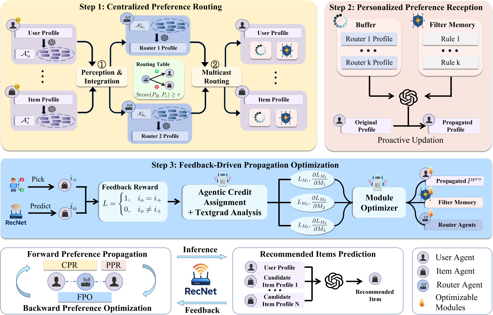

# RecNet

## 🚀 Quick Start




1. Deploy the LLMs used for inference on the server, using provided scripts and adjust the model names in deploy.sh.
    ```bash
    cd serve
    bash deploy.sh
    ```

2. Setting the dataset and run RecNet on the client. Please set the correct server IP and other settings in model_list.yaml.
    ```bash
    cd infer/
    bash train.sh
    ```
3. Prompt templates used in RecNet can be found in ./Appendix.pdf.

4. Codes used for further testing performances of small models are listed in ./recbole. 